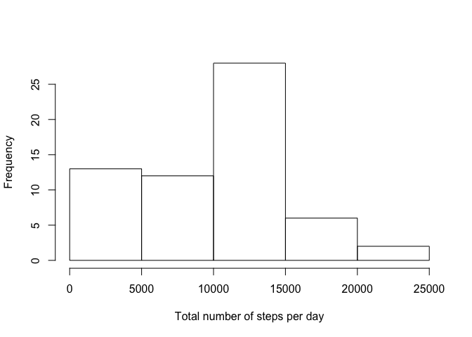
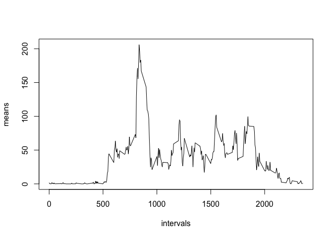
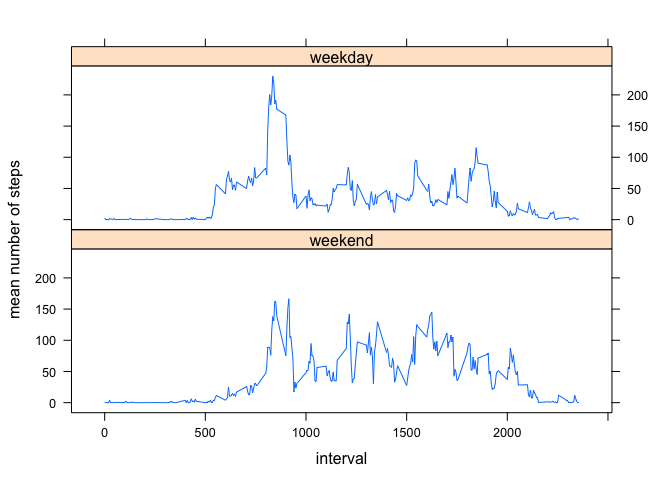

# Reproducible Research: Peer Assessment 1
<br />
<br />

## Loading and preprocessing the data
I assume that the files have already been cloned from GitHub. The following code loads the data into R, coerces the date column into a POSIXlt format and then calls str() on the data in order to provide a rough idea of what it is that we're dealing with. 


```r
unzip('activity.zip')
activity <- read.csv('activity.csv', header = TRUE)
activity$date <- as.Date(activity$date)
str(activity)
```

```
## 'data.frame':	17568 obs. of  3 variables:
##  $ steps   : int  NA NA NA NA NA NA NA NA NA NA ...
##  $ date    : Date, format: "2012-10-01" "2012-10-01" ...
##  $ interval: int  0 5 10 15 20 25 30 35 40 45 ...
```
<br />
<br />

## What is mean total number of steps taken per day?
To address this part of the assignment, it is necessary to split the data by day to create daily subsets of data to which the required analytical functions can be applied. The following code creates a list, 'days', containing the data for each day in the data set.

```r
days <- split(activity, activity$date)
```

This code calculates the total number of steps taken per day (ignoring missing values):

```r
tSteps <-sapply(days, function(x) sum(x$steps, na.rm = TRUE))
```

And this code plots a histogram of the total number of steps taken per day:

```r
hist(tSteps, xlab = 'Total number of steps per day', main = '')
```

 

Finally, these last two functions calculate the mean and median of the total number of steps taken per day.

```r
mean(tSteps)
```

```
## [1] 9354.23
```


```r
median(tSteps)
```

```
## [1] 10395
```
<br />
<br />

## What is the average daily activity pattern?
Here I create a list of the $steps columns for each day and then transform this list of numeric vectors into a 288x61 data frame. This approach requires that I initalise a few variable and build a function that will make my list.

```r
store <- list()
counter <- 0

listBuild <- function(x){
        for (i in 1:length(x)){
                .GlobalEnv$counter <- .GlobalEnv$counter + 1
                z <- as.numeric(x[[i]]$steps)
                .GlobalEnv$store[[as.character(.GlobalEnv$counter)]] <- z
        }
}
listBuild(days)
df <- as.data.frame(store)
```

As each row in this data frame corresponds to a time interval, it's a fairly simple task to obtain the row means (again, ignoring NA values) and plot them against a vector of the intervals.

```r
means <- rowMeans(df, na.rm = TRUE)
intervals <- days[[1]]$interval
plot(intervals, means, type = 'l')
```

 

The interval with the maximum average number of steps can be obtained by subsetting the intervals vector with a boolean vector indicating the maximum mean number of steps.

```r
intervals[means == max(means)]
```

```
## [1] 835
```
<br />
<br />

## Imputing missing values
First, a straightforward task of summing the Boolean value of 'is.na()' called on the 'steps' column of the original data frame.

```r
sum(is.na(activity$steps))
```

```
## [1] 2304
```

Next I create an ammended data frame, that contains an index column 
representing each daily time interval with the same integer.

```r
activityI <- cbind(activity, c(1:288))
```

I am now able to create a function that identifies missing values and replaces them with the mean value for that particular time slot, as determined in the 'means' vector. A vector of steps (recorded and inferred) is created in the vector 'col'. This vector is then used to replace the old 'steps' information.

```r
col <- numeric()
replaceNA <- function(x){
        for (i in 1:nrow(x)){
                if (is.na(x[i, 1])){
                        col <<- c(col, means[x[i, 4]])
                }
                else {
                        col <<- c(col, x[i, 1])
                }
        }
}
replaceNA(activityI)
activityI[,1] <- col
```

I now apply similar code to that used in the first section of this assignment to create the updated histogram and obtain the updated mean and median information.

```r
daysI <- split(activityI, activityI$date)
tStepsI <-sapply(daysI, function(x) sum(x$steps))
hist(tStepsI, xlab = 'Total number of steps per day', main = '')
```

 

```r
mean(tStepsI)
```

```
## [1] 10766.19
```

```r
median(tStepsI)
```

```
## [1] 10766.19
```

As you see, replacing the missing values resulted in an increase in both the mean and median estimated values for the total number of steps per day.
<br />
<br />
<br />

## Are there differences in activity patterns between weekdays and weekends?
I use similar code to that which I used to replace missing values to create a factor vector specifying whether a given entry occured on a weekday or weekend. This factor variable is then bound to the 'activityI' dataframe. 

```r
weekday <- factor(levels = c('weekday', 'weekend'))
detW <- function(x){
        for (i in 1:nrow(x)){
                if (weekdays(x[i, 2]) == 'Saturday' | weekdays(x[i, 2]) == 
                            'Sunday'){
                        weekday <<- c(weekday, 'weekend')
                }
                else {
                        weekday <<- c(weekday, 'weekday')
                }
        }
}
detW(activityI)
activityI[,5] <- weekday
```

I'm now able to split the 'activityI' data frame by the factor 'weekday' and process the resulting sub data frames to obtain the mean values for the number of steps taken for each interval. This is accomplished in the same manner that I obtained the mean values for the original 'activity' dataframe.

```r
colnames(activityI) <- c('steps', 'date', 'interval', 'interval index', 'weekday')
fork <- split(activityI, activityI$weekday)
dataWd <- split(fork$weekday, fork$weekday$date)
dataWe <- split(fork$weekend, fork$weekend$date)
listWd <- list()
listWe <- list()

counter <- 0
listBuildWd <- function(x){
        for (i in 1:length(x)){
                .GlobalEnv$counter <- .GlobalEnv$counter + 1
                z <- as.numeric(x[[i]]$steps)
                .GlobalEnv$listWd[[as.character(.GlobalEnv$counter)]] <- z
        }
}
listBuildWd(dataWd)

counter <- 0
listBuildWe <- function(x){
        for (i in 1:length(x)){
                .GlobalEnv$counter <- .GlobalEnv$counter + 1
                z <- as.numeric(x[[i]]$steps)
                .GlobalEnv$listWe[[as.character(.GlobalEnv$counter)]] <- z
        }
}
listBuildWe(dataWe)

dfWe <- as.data.frame(listWe)
dfWd <- as.data.frame(listWd)
meansWe <- as.data.frame(rowMeans(dfWe))
meansWd <- as.data.frame(rowMeans(dfWd))
```

Having obtained the mean values, I then need to assemble them in a dataframe with the factor and interval information that will allow me to plot the required time series'.


```r
meansWd[,2] <- factor('weekday')
meansWe[,2] <- factor('weekend')
colnames(meansWe) <- c('means', 'day')
colnames(meansWd) <- c('means', 'day')
weekMeans <- rbind(meansWe, meansWd)
weekMeans[,'intervals'] <- intervals

library(lattice)
xyplot(means ~ intervals | day, weekMeans, type = 'l', xlab = 'interval', ylab = 'mean number of steps', layout = c(1, 2))
```

 

This completes the assignment!
